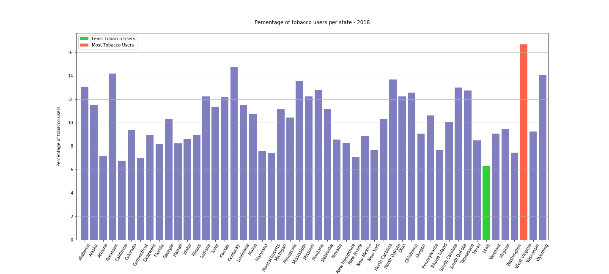

Project: Tobacco Usage in USA
-----------------------------

The project is about what category/kind of people in USA use the tobacco products most in year 2018 and whether tobacco usage has been decreased or increased over last 8 years(2011-2018). It analysis the data from all states and see if there is any correlation between tobacco usage and (gender, income level, education level).

Source of Data: 
--------------
We found the tobacco related data on CDC website (Centers for Disease Control and Prevention).
The data is from Behavioral Risk Factor Surveillance System (BRFSS). This is the nation's premier system of health-related telephone surveys that collect state data about U.S. residents regarding their health-related risk behaviors, chronic health conditions, and use of preventive services.The data is from 2011 to 2018 for all states of America.

Skills Used:
-----------
Python, Pandas, Matplotlib, Scipy, Python API

In a team of 3 members, My Role was to:
--------------------------------------
-Find the percentage of tobacco users across each state of US

-Determine the US state having most tobacco usage

-Calculate the Percentage of Male vs Female tobacco users

-Compare Current Smokers vs Former Smokers

-Made an API call to identify the Average Percentage of Tobacco Users over the last 8 years

Summary Findings:
-----------------

-Based on research & data analysis, we found that West Virginia (WV) has highest number of tobacco users (approx. 16.66%) and Utah(UT) has least number of tobacco users (approx. 6.27%)

-Then, we found out that tobacco usage is not uniform across gender. Adult males(62.7%) were significantly more likely to use tobacco than females(37.3%).    

-Tobacco use (Smoke & Smokeless) has declined from 18.75% (nearly 19 of every 100 adults) to 14.47% (14 of every 100 adults) in the year 2018 across USA.

-Tobacco usage has been significantly decreasing each year from 2011 to 2018, as numerous actions are implementing by CDC and state health department to reduce tobacco use to the point that it is no longer a public health problem for the Nation ( "Healthy People 2020" - The goal is to reduce illness, disability, and death related to tobacco use and secondhand smoke exposer).

-Based on the findings for 2018 there is a correlation between the number of tobacco users and their education levels. The findings per the research and data gathered, shows that the number and percentage of the Tobacco consumer reduces with the level of education. It came to know that 67% of the Tobacco Users have a High School Education or less than High School Education. 33% of the Tobacco Users had Some Post High School or College Degree.

-Based on the findings for 2018 there is a correlation between the number of tobacco users and their income. The analysis shows that the majority of tobacco users tend to have a lower income compared to those with a higher level income. 67% of the Tobacco Users have a High School Education or less than High School Education. 33% of the Tobacco Users had Some Post High School or College Degree.

Project Conclusion
------------------
Based on our research and data analysis, we have identified that Tobacco usage is higher in males with lower income and lower education.

